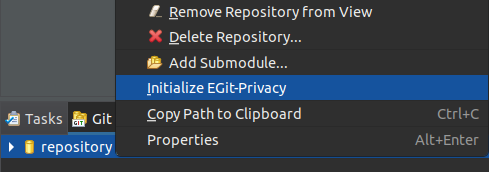
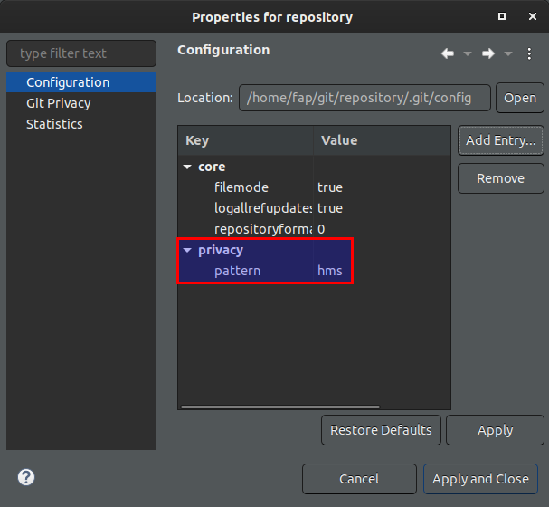
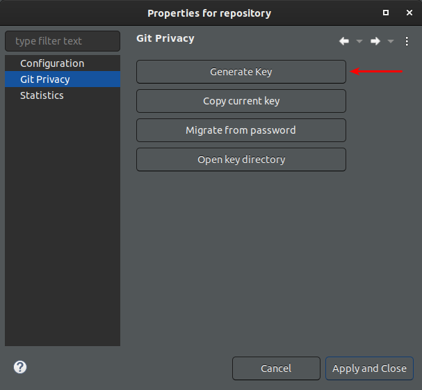
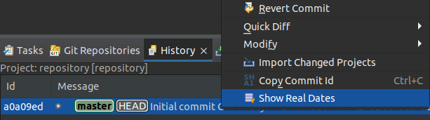
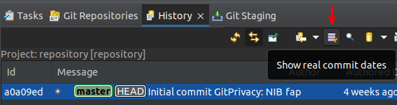
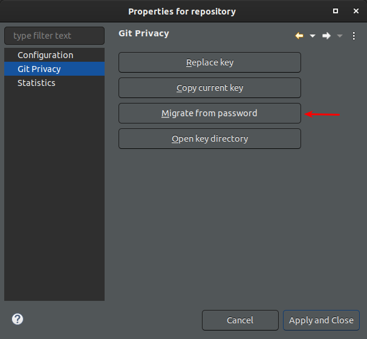

== egit-privacy

== What's the purpose of this plug-in?

The goal of this plug-in is to give Eclipse users the ability to reduce the amount of personal information that they are leaking when interacting the Git version control system.
It allows you to

* redate new commits based on a fixed pattern
* redate new commits based on a chosen time window
* save the original commit dates in encrypted form
* decrypt and show the original commit dates

=== Requirements

EGit-Privacy requires git-privacy, which can be installed through pip:

----
pip3 install gitprivacy
----

NOTE: git-privacy requires Python version 3.6 or later and Git version 2.22.0 or later.

=== Installation

== Installing the Eclipse Plugin

// The Plugin is available at the Eclipse Marketplace: https://marketplace.eclipse.org/content/...

The plug-in can be installed through the p2 update site at: https://empri-devops.vogella.com/p2-repository

This p2 update site can be entered in the following dialog by clicking menu:Help[Install New Software...].

=== Repository Initialization

To initialize the git-privacy hooks in a repository open the Git Repositories view.
Then click right on the repository to open the context menu and choose `Initialize EGit-Privacy` and follow the instructions.

After that configure the plug-in to your liking in the Git config.
You can access the Git config in Eclipse by doing a right click on the repository and choosing menu:Properties[Configuration].

=== Encrypting original time stamps

The encryption of the original time stamps is done with a cryptographic key.
The original time stamps will be automatically encrypted and added to the commit message once you have created a key.
To create a key open the properties of a Git repository by opening the `Git Repositories` view, right clicking on a repository and choosing menu:Properties[Git Privacy].

=== Viewing original time stamps

If your repository contains encrypted commit dates and you have the right key then you can view them in the Eclipse user interface.
You can either view an overview of all the commits with the original commit dates decrypted or you can view the original commit date for a specific commit.
Both options are accessible in the Git History view.

To show the original commit date of a single commit right click on the commit and choose `Show Real Dates`:

To view a list of commits with their original commit dates decrypted click the `Show real commit dates` button in the toolbar:

=== Supported configuration options

For detailed explanation of what each configuration option does please see the https://github.com/EMPRI-DEVOPS/git-privacy#configuration-options[git-privacy README].

The following configuration options are supported by EGit-Privacy:

- privacy.ignoreTimezone
- privacy.limit
- privacy.mode
- privacy.pattern
- privacy.replacements

=== Migrating from password based encryption

Old versions of this plug-in used an encryption method based on a password and a salt.
This method of encryption is no longer supported.
You can migrate to the new key based encryption method through the Git Privacy property page.
Open the property page of a Git repository by opening the `Git Repositories` view, right clicking on a repository and choosing menu:Properties[Git Privacy].
Then click on `Migrate from password`.

NOTE: This button will only be activated if a password and salt is found either in the Git config (`privacy.password` and `privacy.salt`) or in the Eclipse preferences.

=== Global setup

git-privacy supports setting itself up globally so that all newly created Git repositories are created with the git-privacy hooks in place.
This is accomplished through a git template folder.
Sadly JGit, the Git implementation used by Eclipse, doesn't support template directories at this point.
To use this feature please set up git-privacy as usual through

----
$ git-privacy init --global
----

initialize new repositories on the command line with

----
$ git init
----

and import the newly created repository into Eclipse.

=== Installing the development build

Build the plug-in with maven by running this command in the project root directory:

[source, terminal]
----
scripts/build
----

This will create an update site in `updatesite/target/repository/`.
Install the plug-in from the update site via menu:Help[Install New Software... > Add > Local].

=== Attribution

- `icons/encryption-menu.png` by https://freeicons.io/office-and-workstation-icons-4/data-encryption-icon-18819[Free Preloaders], Licensed under https://creativecommons.org/licenses/by/3.0/[Attribution 3.0 Unported (CC BY 3.0) ], used unchanged
- `icons/redact-email.png` created from https://freeicons.io/user-interface-22/mail-envelope-message-inbox-email-icon-123655[ColourCreatype], Licensed under https://creativecommons.org/licenses/by/3.0/[Attribution 3.0 Unported (CC BY 3.0) ] and https://freeicons.io/regular-life-icons/pencil-icon-17870[Anu Rocks], Licensed under https://creativecommons.org/licenses/by/3.0/[Attribution 3.0 Unported (CC BY 3.0) ]
